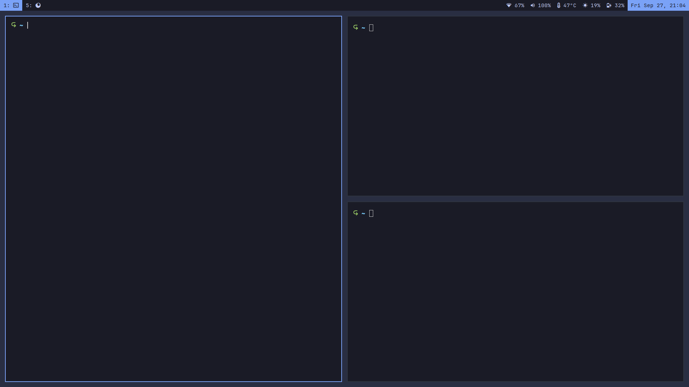

# myAwesomewmConfig

## Requirements
- scrot
- kitty
- fzf
- i3lock-color
- ripgrep
- alsa-utils
- networkmanager
- ttf-jetbrains-mono-nerd

## Installation
```sh
cd ~/.config/awesome/
git clone --depth 1 https://github/thevimmer/myAwesomewmConfig
echo 'require("myAwesomewmConfig")' > rc.lua
```
